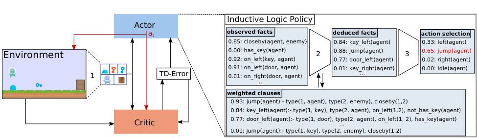

# LogicRL

This is the code for RL agents using logic.


## Installation

```bash
pip install -r requirements.txt
```

from the nsfr folder:

```bash
pip install -e . # installs in dev mode
```

You also need to install QT-5 for Threefish and Loot:

```bash
apt-get install qt5-default
```

## How to use

**Example to play with a trained ppo agent**

```
python3 play.py -s 0 -alg ppo -m getout -env getout  
```  

The trained model can be found in folder: _models/getout_ or _models/threefish_

**Example to train an logic agent for getout env using 'getout_human_assisted' rules.**

```
python3 train.py -s 0 -alg logic -m getout -env getout  -r 'getout_human_assisted'
```

Models will be saved to folder: src/checkpoints  
Models that use to run should be moved to folder: src/models  

Description of Args

* **--algorithm -alg**:

The algorithm to use for playing or training, choice: _ppo_, _logic_.

* **--mode -m**:

Game mode to play or train with, choice: _getout_, _threefish_, _loot_.

* **--environment -env**:

the specific environment for playing or training,

_getout_ contains key, door and one enemy.  
_getoutplus_ has one more enemy.  
_threefish_  contains one bigger fish and one smaller fish.  
_threefishcolor_  contains one red fish and one green fish. agent need to avoid red fish and eat green fish.  
_loot_  contains 2 pairs of key and door.  
_lootcolor_  contains 2 pairs of key and door with different color than in loot.  
_lootplus_    contains 3 pairs of key and door.

* **--rules -r**:

_rules_ is required when train logic agent.

Logic agent require a set of data which provide the first order logic rules.

e.g. '_getout_human_assisted_' indicate the rules is human-generated.

So for new rules, just need to be added to the choice of argument '--rules' and dataset.

dataset can be found in folder: _src/nsfr/data_

'--rules' is also for some situation like using reward shaping:

e.g. 'ppo_simple_policy' can be helpful when train ppo agent of getout

* **--recovery -re**:

The data will be saved automatically to the folder of models.
If the training crashed, you can set '-re' to True to continue the training by input the last saved model.

* **--plot -p**:

If True, plot the weight as a image.  
Image willbe saved to folder: src/image

* **--log -l**:

if True, the state information and rewards of this run will be saved to folder: src/logs
(for playing only)


* **--render**:

If True, render the game.  
(for playing only)

**Using Beam Search to find a set of rules**


With scoring:

```
python3 beam_search.py -m getout -r getout_root -t 3 -n 8 --scoring True -d getout.json  
``` 

Without scoring:

``` 
python3 beam_search.py -m threefish -r threefishm_root -t 3 -n 8 
``` 

* **--t**:  Number of rule expansion of clause generation.
* **--n**:  The size of the beam.
* **--scoring**: To score the searched rules, a dataset of states information is required.
* **-d**: The name of dataset to be used for scoring.

